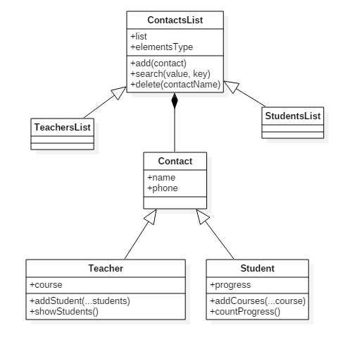

## [Online Preview](https://zuhairtaha.github.io/Node.js/week2/homework/studentsTeachersClasses/)

classes diagram (UML) shows main classes with inheritance and composition 

This is an important reading :book: that will help you with home-works :notebook::

https://developer.mozilla.org/en-US/docs/Learn/JavaScript/Objects/Object-oriented_JS

*Homework part1* :one:
Create a class called _StudentContact_ which extends the _Contact_ class which allows to add the courses the students has taken and the progress ( _progress_ must be a property)

*Homework part2* :two:
Create a class called ContactTeacher which extends the Contact class. This class has to have a method called _addStudentContact_ which takes a _StudentContact_, and a method called _showStudents_, which will list all the students for that teacher.

You can use the _Contact_ class I've uploaded on this channel (src.zip is the most updated but needs to be transpiled with babel)  :upside_down_face:

If you have questions, just write them in the channel :slightly_smiling_face: :rocket:

happy coding! :nerd_face:

_Note1: remember to use babel or the node-scaffolder tool for create your project (https://www.npmjs.com/package/node-scaffolder)_ (edited)

